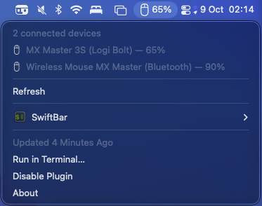

#  OpenLogi Batteries for SwiftBar

A read-only macOS menu bar plugin showing peripheral battery levels from the
[OpenLogi CLI](https://github.com/AprilNEA/OpenLogi), hosted by
[SwiftBar](https://github.com/swiftbar/SwiftBar). The plugin uses no analytics,
accounts or remote services.



The menu bar shows the lowest readable battery percentage among connected
devices. Click it for an alphabetically sorted list of devices, their connection
types, battery percentages and charging states.

## Requirements

- macOS 13.5 or later (required by Node.js 24) and SwiftBar 2.1.1 or later.
- Node.js 24 or later (local development uses the LTS version pinned in mise).
- A working standalone `openlogi` executable supporting `openlogi list`.

The OpenLogi desktop app does not necessarily install the standalone CLI. Use
the
[OpenLogi development guide](https://github.com/AprilNEA/OpenLogi/blob/master/docs/DEVELOPMENT.md)
if you need to build it. Confirm `openlogi list` works before installing this
plugin. Logi Options+ must not own the same HID++ receiver while OpenLogi reads
it.

## Install

Install SwiftBar and mise if needed:

```sh
brew install --cask swiftbar
brew install mise
```

Open SwiftBar and select a plugin folder, for example `~/Documents/SwiftBar`.
Then clone this repository and install:

```sh
git clone https://github.com/mwz/swiftbar-openlogi.git
cd swiftbar-openlogi
mise trust
mise install
mise exec -- pnpm install --frozen-lockfile --ignore-scripts
mise exec -- pnpm run check
mise exec -- pnpm run install-plugin --plugin-dir "$HOME/Documents/SwiftBar"
```

Only `openlogi.5m.sh` is installed in that watched folder. Compiled application
files and configuration live under
`~/Library/Application Support/swiftbar-openlogi/`. The installed plugin does
not need this checkout or `node_modules` at runtime; it uses only Node
built-ins.

Choose **Refresh All** in SwiftBar. Enable **Launch at Login** in SwiftBar if
desired. Use SwiftBar's plugin controls to disable/re-enable this plugin without
quitting other menu bar plugins.

### Executable paths

By default the plugin tries `/opt/homebrew/bin/openlogi`,
`/usr/local/bin/openlogi`, then `~/.cargo/bin/openlogi`. Homebrew symlinks and
user-local installations are supported. It does not search an inherited `PATH`.

For any other location, supply an explicit absolute path:

```sh
mise exec -- pnpm run install-plugin --plugin-dir "$HOME/Documents/SwiftBar" \
  --openlogi "$HOME/tools/openlogi"
```

You can also set **OPENLOGI_PATH** in SwiftBar's plugin variables. A non-empty
value overrides the installed configuration; leave it empty to use that
configuration or automatic discovery. A bad override produces an error rather
than silently selecting another executable.

The installer captures an absolute Node path, preferring a stable Homebrew
symlink when it points to the current interpreter. Use `--node /absolute/path`
to select another Node 24+ executable. No fish, mise, zsh or bash initialisation
is needed. If a version-manager upgrade removes that executable, rerun the
installer. A missing Node runtime is reported in the menu.

## Behaviour

| Situation                                        | Result                                                                       |
| ------------------------------------------------ | ---------------------------------------------------------------------------- |
| Multiple devices                                 | Lowest readable percentage; alphabetical tie-break                           |
| Dropdown                                         | All online devices, alphabetically sorted                                    |
| Unknown battery                                  | “Battery unavailable”; excluded from minimum                                 |
| Charging                                         | Charging label, and a charging menu bar icon when that device is the minimum |
| No readable online batteries                     | Item hidden, including camera-only inventories                               |
| Missing CLI, failed command, bad data or timeout | `?` and a concise error; no partial inventory                                |
| Refresh                                          | Startup, every five minutes and the Refresh action                           |
| Menu opening                                     | Immediate; shows the latest completed refresh without rerunning the CLI      |
| Refresh in progress                              | Previous completed SwiftBar display remains visible                          |

Mouse, trackball, keyboard, numpad, touchpad, headset, gamepad and joystick use
native SF Symbols; unknown types use a battery icon. Rows show Logi Bolt,
Unifying, Lightspeed, generic receiver, direct Bluetooth, wired USB or unknown
connection labels, with additional details in their tooltips. The parser never
infers the current transport just from a device's supported transports.

The script emits a complete menu once per query. It does not print an interim
blank/loading menu or keep a persistent battery cache. SwiftBar may show its own
initial placeholder on launch. Failures replace the previous reading with `?`; a
successful empty inventory deliberately hides the item. SwiftBar handles
sleep/wake scheduling and can refresh overdue plugins after waking.

## Execution and data handling

- Runs `openlogi list` directly, without interpolating device data into a shell.
- Five-second query deadline; at most 64 KiB stdout and 8 KiB stderr.
- A separate Node guard kills the producer's process group on timeout,
  cancellation or loss of the parent plugin, including parent SIGKILL. Both
  streams are read concurrently, and failed queries discard partial output.
- Parser bounds match the Omarchy plugin: 65,536 UTF-16 code units, 1,024 lines,
  2,048 per line, 24 devices including offline devices, 256-character names,
  64-character kind/WPID fields and 256-character battery fields. Slots must be
  0–255; percentages must be whole numbers from 0–100. Malformed numeric battery
  values reject the entire inventory; unavailable battery text remains
  supported.
- Non-empty output must contain recognised device rows, inventory headers, a
  camera section or the explicit no-hardware message. Unrecognised output is an
  error rather than a hidden item; empty output remains an empty inventory.
- Concurrent plugin invocations share the in-flight result over a private local
  Unix socket. The socket is removed on completion; a stale socket after a crash
  is recovered on the next refresh. There is no background daemon or TCP port.
- The command receives a small environment (`PATH`, `LC_ALL`, `HOME` and, when
  present, `TMPDIR`) and runs from `/`. macOS user paths are retained for agent
  discovery; Linux `/run/user` paths and root-only executable rules are not
  used.
- Names/errors are sanitised for SwiftBar syntax. Only fixed application code
  defines menu actions. The plugin does not save CLI output or battery readings,
  send network requests, change device settings or request administrator access.

SwiftBar and OpenLogi remain independent applications with their own behaviour;
these statements describe this plugin, not a sandbox around either application.
SwiftBar may retain rendered menus in its own diagnostic facilities.

## Update and remove

Pull the latest code, run `mise install` and
`mise exec -- pnpm install --frozen-lockfile --ignore-scripts`, then rerun the
install command. Existing executable configuration is preserved unless
explicitly overridden. Installation refuses to overwrite an unrelated
`openlogi.5m.sh`. The launcher is replaced atomically. Reinstalling identical
code reuses its compiled files; older code versions are retained until uninstall
so in-flight queries are not disrupted.

```sh
mise exec -- pnpm run uninstall-plugin --plugin-dir "$HOME/Documents/SwiftBar"
```

This removes only this plugin and its support files for that folder. It leaves
SwiftBar, Node, OpenLogi and other plugins installed.

## Development and verification

```sh
mise trust
mise install
mise exec -- pnpm install --frozen-lockfile --ignore-scripts
mise exec -- pnpm run check
```

`mise.toml` pins **Node 24.21.0**, the latest LTS when this configuration was
updated, and **pnpm 12.9.1**. The `packageManager` field in `package.json` pins
the same pnpm version. Exact pins keep local development and CI reproducible;
they do not silently switch to a newer Node release. The runtime still supports
Node 24 or later.

With mise activated in your shell, you can use `pnpm` directly. `mise exec --`
also works without shell activation. To deliberately update Node to the newest
LTS, run `mise use --pin node@lts`, then commit the configuration change. Keep
the pnpm version in `mise.toml` and `package.json` aligned when updating it.

TypeScript builds to `dist/`. Tests cover parsing, limits, menu syntax, process
cleanup, coalescing, stale sockets, installation, and the installed launcher.
GitHub Actions uses the same mise pins on Linux and macOS, and also tests the
latest stable Node release using `node@latest` for forward compatibility. The
latest-release jobs follow new releases automatically, without changing the
local LTS pin. Dependency installation uses the committed `pnpm-lock.yaml` in
frozen-lockfile mode. Synthetic tests do not require Logitech hardware.

Some sandboxed execution environments prohibit Unix socket listening. Only in
such an environment, `SWIFTBAR_SKIP_SOCKET_TESTS=1 mise exec -- pnpm run check`
skips the four socket-dependent tests. A skipped run is not a substitute for the
full CI suite.

Before release, manually check SwiftBar on a Mac: Bolt/Bluetooth readings,
charging, disconnect/reconnect, menu refresh without flicker, slow-query menu
responsiveness, sleep/wake, and disable/re-enable. Exact pixel layout and actual
hardware cannot be established by the synthetic tests.

## Alignment and licence

Ported from the MIT-licensed
[openlogi-raycast](https://github.com/mwz/openlogi-raycast), with bounds and
process-supervision behaviour aligned to
[openlogi-battery-omarchy](https://github.com/mwz/openlogi-battery-omarchy). The
CLI text format remains an upstream compatibility dependency; a future
machine-readable interface can replace the parser without changing the menu.

Independent community project, not affiliated with Logitech, OpenLogi or
SwiftBar.

[MIT licence](LICENSE)
